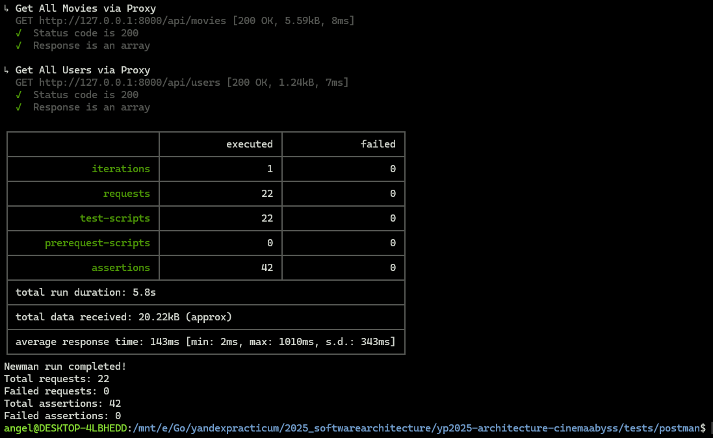
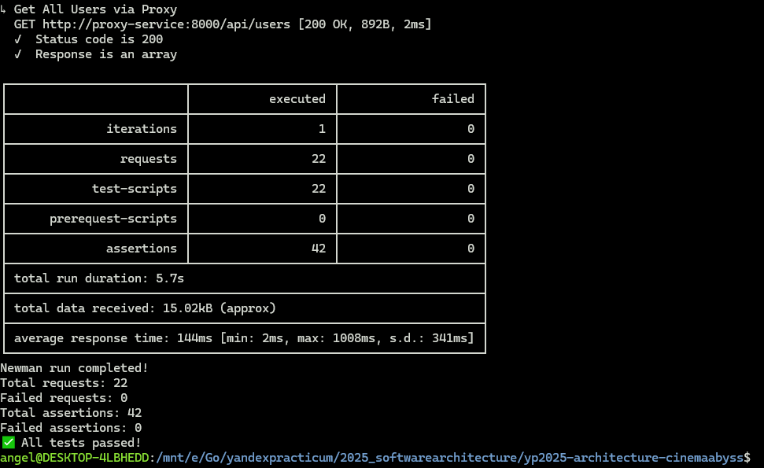
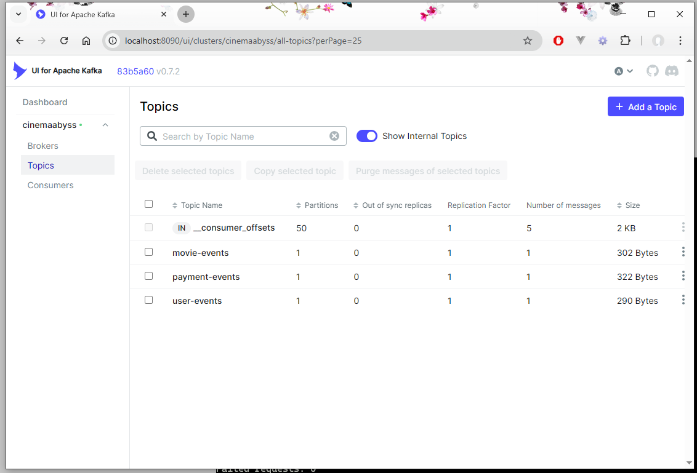
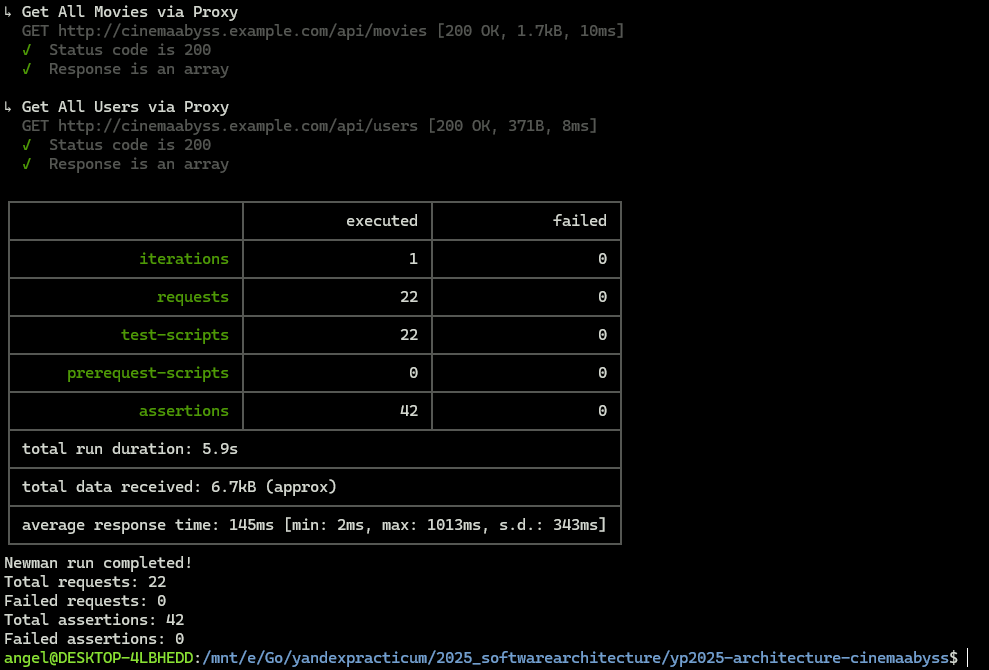
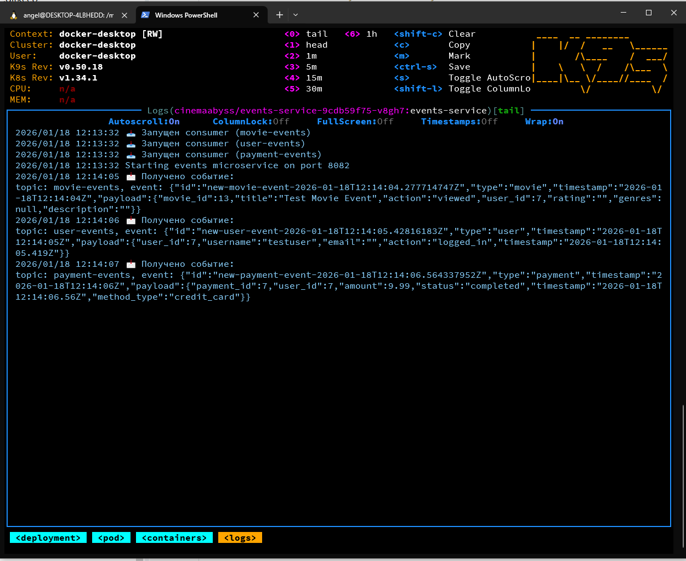
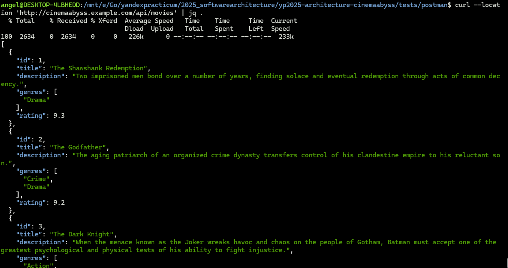
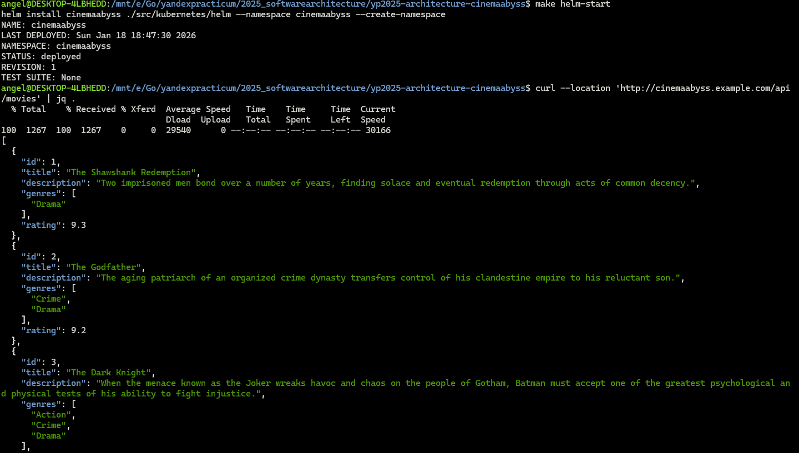

## Изучите [README.md](.\README.md) файл и структуру проекта.

# Задание 1

1. Спроектируйте to be архитектуру КиноБездны, разделив всю систему на отдельные домены и организовав интеграционное взаимодействие и единую точку вызова сервисов.
Результат представьте в виде контейнерной диаграммы в нотации С4.
Добавьте ссылку на файл в этот шаблон


# Задание 2

### 1. Proxy
Команда КиноБездны уже выделила сервис метаданных о фильмах movies и вам необходимо реализовать бесшовный переход с применением паттерна Strangler Fig в части реализации прокси-сервиса (API Gateway), с помощью которого можно будет постепенно переключать траффик, используя фиче-флаг.


Реализуйте сервис на любом языке программирования в ./src/microservices/proxy.

- После реализации запустите postman тесты - они все должны быть зеленые (кроме events).
- Отправьте запросы к API Gateway:
   ```bash
   curl http://localhost:8000/api/movies
   ```
- Протестируйте постепенный переход, изменив переменную окружения MOVIES_MIGRATION_PERCENT в файле docker-compose.yml.


### 2. Kafka
 Вам как архитектуру нужно также проверить гипотезу насколько просто реализовать применение Kafka в данной архитектуре.

Для этого нужно сделать MVP сервис events, который будет при вызове API создавать и сам же читать сообщения в топике Kafka.

    - Разработайте сервис на любом языке программирования с consumer'ами и producer'ами.
    - Реализуйте простой API, при вызове которого будут создаваться события User/Payment/Movie и обрабатываться внутри сервиса с записью в лог
    - Добавьте в docker-compose новый сервис, kafka там уже есть

Необходимые тесты для проверки этого API вызываются при запуске npm run test:local из папки tests/postman 
Приложите скриншот тестов и скриншот состояния топиков Kafka из UI http://localhost:8090 

### Test Local



#### Tests Docker



#### Kafka Topics



# Задание 3

Команда начала переезд в Kubernetes для лучшего масштабирования и повышения надежности. 
Вам, как архитектору осталось самое сложное:
 - реализовать CI/CD для сборки прокси сервиса
 - реализовать необходимые конфигурационные файлы для переключения трафика.


### CI/CD

 В папке .github/worflows доработайте деплой новых сервисов proxy и events в docker-build-push.yml, чтобы api-tests при сборке отрабатывали корректно при отправке коммита в ваш репозиторий.

Как только сборка отработает и в github registry появятся ваши образы, можно переходить к блоку настройки Kubernetes
Успешным результатом данного шага является "зеленая" сборка и "зеленые" тесты


### Proxy в Kubernetes

#### Шаг 2

Запустите тесты из папки tests/postman

```bash
 npm run test:kubernetes
```

Часть тестов с health-чек упадет, но создание событий отработает.
Откройте логи event-service и сделайте скриншот обработки событий

#### Шаг 3
Добавьте сюда скриншота вывода при вызове https://cinemaabyss.example.com/api/movies и скриншот вывода event-service после вызова тестов.

#### Kube Tests



#### Kube Events



### Get Movies From Kube



# Задание 4
Для простоты дальнейшего обновления и развертывания вам как архитектуру необходимо так же реализовать helm-чарты для прокси-сервиса и проверить работу 

Вызовите 
https://cinemaabyss.example.com/api/movies
и приложите скриншот развертывания helm и вывода https://cinemaabyss.example.com/api/movies

#### Helm



